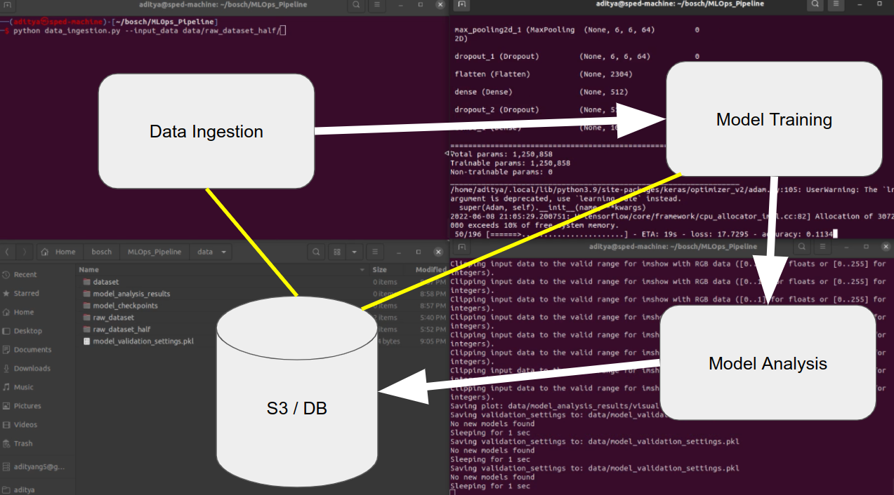
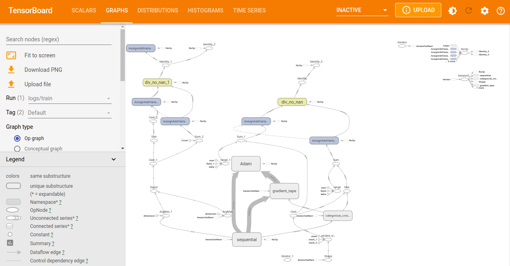

# Toy ML Ops Pipeline

A simple demonstration of an ML Ops pipeline involving three stages:
1. Data Ingestion
2. Model Training
3. Model Analysis



Video Demo (3 Minutes): <a href="https://drive.google.com/file/d/1ni1Sq3sTFeZ01gS82wZP5bVD4P4w-wSe/view?usp=sharing">Toy ML Ops Pipeline Video Demo</a>


## Data Ingestion

Reads a folder with the following structure
```bash
data/raw_dataset
├── test
│   ├── img1.png
│   ├── img2.png
│   ├── ...
│   ├── imgn.png
│   └── groundtruth.csv
└── train
    ├── img1.png
    ├── img2.png
    ├── ...
    ├── imgn.png
    └── groundtruth.csv
```

The folder is written to a python dict of the following pattern and the dataset pickled to `data/dataset/*.pkl`
```python
dataset = {
    'test': {
        'img':   [],
        'label': [],
        'class': []     # One hot encoded label
    },
    'train': {
        'img':   [],
        'label': [],
        'class': []     # One hot encoded label
    }
}
```

## Model Training

The model training process listens to the creation of a new dataset pickle file. Once a new dataset is found, a model is trained using the given dataset and the pickle of the model and its training history is saved to `data/model_checkpoints/*.pkl`.

Right now model and training hyperparameters are hard coded, ideally should be made dynamic. Given `n` datasets, `m` models and `o` hyperparameter_sets, the pipeline should train and 

## Model Analysis

The model analysis process listens to the creation of a new `trained_model` pickle file. Once a new model is found, its corresponding dataset is loaded in and it is tested upon. Generated graphs are stored in `data/model_analysis_results/*.png`. The generated graphs include accuraccy and validation accuraccy vs epochs, loss and validation loss vs epochs and failure cases of the model (a sample of test cases where the model failed spectacularly or with high confidence). Since Tensorboard Logs are also stored, they can also be opened up using:
```bash
tensorboard --logdir data/model_checkpoints/2022-06-08\ 20\:57\:20.868637/
```



# Future Work

1. Right now model is hard coded, ideally should be made dynamic
2. Training hyperparameters are fixed, should be made dynamic
3. Given `n` datasets, `m` models and `o` hyperparameter_sets, the pipeline should train and analyze a total of `n x m x o` combinations and should be running as a priority queue (more recent datasets first, models with higher priority first, etc.)
4. Migrate everything to docker containers so they can easily be run on cloud infra
5. Input/Output through web UI (less CLI)


## Project Structure

```bash
├── constants.py
├── data
│   ├── dataset
│   │   ├── 2022-06-08 20:57:20.868637.pkl
│   │   └── 2022-06-08 21:06:24.942420.pkl
│   ├── model_analysis_results
│   │   ├── plot_model_2022-06-08 20:57:20.868637.pkl.png
│   │   ├── plot_model_2022-06-08 21:06:24.942420.pkl.png
│   │   ├── visualize_errors_2022-06-08 20:57:20.868637.pkl.png
│   │   └── visualize_errors_2022-06-08 21:06:24.942420.pkl.png
│   ├── model_checkpoints
│   │   ├── 2022-06-08 20:57:20.868637
│   │   │   └── logs
│   │   │       └── validation
│   │   ├── 2022-06-08 20:57:20.868637.pkl
│   │   ├── 2022-06-08 21:06:24.942420
│   │   │   └── logs
│   │   │       └── validation
│   │   └── 2022-06-08 21:06:24.942420.pkl
│   ├── model_training_settings.pkl
│   ├── model_validation_settings.pkl
├── data_ingestion.py
├── generate_raw_dataset.py
├── helper.py
├── model_analysis.py
├── model_training.py
└── README.md
```